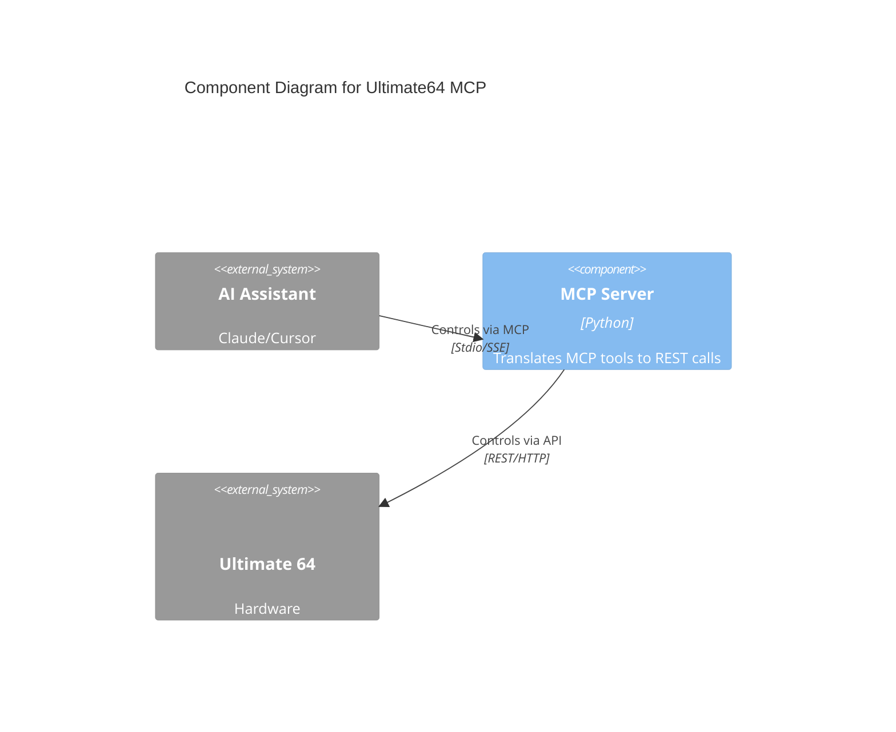

# Ultimate64 MCP

**MCP server for the Ultimate 64 series mainboards and cartridges.**

[View on GitHub](https://github.com/kcalvelli/Ultimate64MCP)

## Overview

A **Model Context Protocol (MCP)** server that enables AI assistants like Claude to control the Commodore 64 Ultimate hardware. It allows loading programs, managing disks, reading memory, and controlling the device via natural language.

## Architecture

The server acts as a bridge between the MCP protocol and the Ultimate 64's REST API.



## Onboarding

You can run the server via Python or Docker.

**Python:**
```bash
git clone https://github.com/kcalvelli/Ultimate64MCP.git
cd Ultimate64MCP/mcp_hosted
pip install -r requirements.txt
python mcp_ultimate_server.py
```

**Docker:**
```bash
docker run -p 8000:8000 -e C64_HOST=192.168.1.64 ultimate64-mcp
```

## Release History

| Version | Date | Status |
| :--- | :--- | :--- |
| - | - | No releases found |