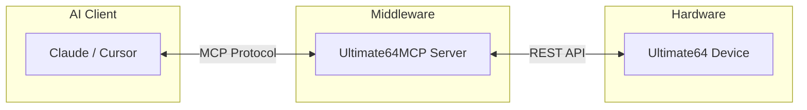

# Ultimate64 MCP

**Repo:** [kcalvelli/Ultimate64MCP](https://github.com/kcalvelli/Ultimate64MCP)

A Model Context Protocol (MCP) server that exposes the Ultimate64's API to LLMs (like Claude). This allows AI agents to control the C64 hardware, load cartridges, or type text.

## Architecture



## Onboarding

Run the server:

```bash
nix run github:kcalvelli/Ultimate64MCP
```

Configure your MCP client (e.g., in `claude_desktop_config.json`) to point to this executable.

## Latest Status

**Release:** *Rolling*
