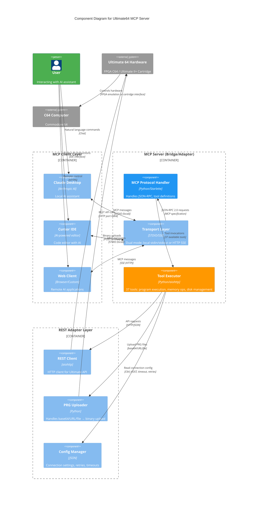

# Ultimate64 MCP

**Flake to provide MCP server for Ultimate 64 series mainboards**

[View on GitHub](https://github.com/kcalvelli/Ultimate64MCP)

## Overview

A **Model Context Protocol (MCP)** server for the **Commodore 64 Ultimate** and compatible devices (Ultimate 64, Ultimate II+). This server enables AI assistants like Claude, ChatGPT, and Cursor to control your C64 via the Ultimate's REST API, translating natural language commands into device operations.

**Supported Devices:**

* **Commodore 64 Ultimate:** Official modern Commodore 64 with Ultimate 64 FPGA mainboard
* **Ultimate 64:** Original FPGA-based Commodore 64 mainboard by Gideon's Logic
* **Ultimate II+:** Cartridge for original C64/C128 adding USB, ethernet, and drive emulation

**Key Features:**

* **37 Tools:** Comprehensive coverage of Ultimate device functionality
* **Dual Transport Modes:** STDIO (local) and SSE (remote/hosted deployments)
* **Dynamic Connection:** Set C64 connection at runtime or via environment variable
* **Program Upload:** Run PRGs from base64, URLs, or local files
* **Docker Support:** Containerized deployment with non-root security
* **Full Device Control:** Load programs, manage disks, read/write memory, configure settings, control streaming

**Status:** Alpha release - tested with Ultimate boards and home network setups

## Architecture

The server implements a classic bridge/adapter pattern, translating MCP protocol requests from AI assistants into REST API calls for Ultimate hardware. It operates as a three-layer system: MCP clients communicate via STDIO or SSE, the adapter server translates to REST calls, and the Ultimate device executes operations on actual C64 hardware.



**Architectural Assumptions:**

* **Three-layer Bridge Pattern:** MCP clients → Adapter Server → Target System, with clear separation between protocol handling (MCP), business logic (37 tools), and external communication (REST API)
* **Dual Transport Architecture:** Single codebase supports both STDIO (for local MCP clients like Claude Desktop) and SSE (for remote/hosted deployments), selected via command-line flag
* **Stateless REST Adapter:** Each tool execution is an independent HTTP request to the Ultimate device; server maintains no persistent connection to C64 hardware
* **Dynamic Connection Management:** C64 host can be set via environment variable (`C64_HOST`), command-line argument, or runtime using `ultimate_set_connection` tool
* **Three PRG Upload Paths:** `ultimate_run_prg_binary` accepts base64-encoded data (for AI-generated code), HTTP URLs (for remote downloads), or local file paths (for server-side storage)
* **Direct REST Fallback:** Exposes `/upload-prg` endpoint for non-MCP clients or large file uploads bypassing MCP protocol overhead
* **Ultimate API Dependency:** All functionality wraps the Ultimate REST API (port 6464 by default); requires Ultimate firmware with API enabled

## Onboarding

### Prerequisites

* Python 3.11+
* A **Commodore 64 Ultimate** (or Ultimate 64/II+/II+L) on your network
* The Ultimate's REST API must be accessible (enabled by default)

### Quick Start - Local STDIO Mode

For local AI assistants (Claude Desktop, Cursor):

```bash
# Clone the repository
git clone https://github.com/kcalvelli/Ultimate64MCP.git
cd Ultimate64MCP

# Install dependencies
pip install -r requirements.txt

# Run in STDIO mode with your C64's IP
export C64_HOST="192.168.1.64"
python mcp_ultimate_server.py --stdio
```

### Quick Start - SSE Mode (Remote/Hosted)

For remote or hosted deployments:

```bash
# Set your Ultimate device's IP address
export C64_HOST="192.168.1.64"

# Start the server (SSE mode is default)
python mcp_ultimate_server.py
```

The server runs on `http://0.0.0.0:8000` by default.

### Docker Deployment

**Build the image:**

```bash
cd mcp_hosted
docker build -t ultimate64-mcp .
```

**Run the container:**

```bash
# With environment variable
docker run -p 8000:8000 -e C64_HOST=192.168.1.64 ultimate64-mcp

# With custom port (if C64 is behind NAT/port forwards)
docker run -p 8000:8000 -e C64_HOST=http://192.168.1.64:6464 ultimate64-mcp

# Start without connection (configure later via tool)
docker run -p 8000:8000 ultimate64-mcp
```

### Client Configuration

**Cursor IDE** - Add to `.cursor/mcp.json`:

For SSE (Remote) Mode:

```json
{
  "mcpServers": {
    "ultimate64-mcp": {
      "transport": {
        "type": "sse",
        "url": "http://your-server-address:8000/sse"
      }
    }
  }
}
```

For STDIO (Local) Mode:

```json
{
  "mcpServers": {
    "ultimate64-mcp": {
      "command": "python",
      "args": ["/path/to/mcp_ultimate_server.py", "--stdio"],
      "env": {
        "C64_HOST": "192.168.1.64"
      }
    }
  }
}
```

**Claude Desktop** - Add to configuration:

```json
{
  "mcpServers": {
    "ultimate64-mcp": {
      "command": "python",
      "args": ["/path/to/mcp_ultimate_server.py", "--stdio"],
      "env": {
        "C64_HOST": "192.168.1.64"
      }
    }
  }
}
```

### Available Tools (37 Total)

**Connection Management:**

* `ultimate_set_connection`, `ultimate_get_connection`, `ultimate_version`

**Program Execution:**

* `ultimate_run_program`, `ultimate_load_program`, `ultimate_run_prg_binary`, `ultimate_run_cartridge`

**Audio Playback:**

* `ultimate_play_sid`, `ultimate_play_mod`

**Memory Operations:**

* `ultimate_read_memory`, `ultimate_write_memory`, `ultimate_write_memory_binary`

**Drive & Disk Management:**

* `ultimate_mount_disk`, `ultimate_unmount_disk`, `ultimate_turn_drive_on`, `ultimate_turn_drive_off`, `ultimate_set_drive_mode`, `ultimate_load_drive_rom`, `ultimate_create_d64`, `ultimate_create_d71`, `ultimate_create_d81`, `ultimate_create_dnp`

**Machine Control:**

* `ultimate_reset_machine`, `ultimate_soft_reset`, `ultimate_reboot_device`, `ultimate_power_off`, `ultimate_get_machine_info`, `ultimate_get_machine_state`

**Configuration:**

* `ultimate_get_config_categories`, `ultimate_get_config_category`, `ultimate_get_config_item`, `ultimate_set_config_item`, `ultimate_bulk_config_update`, `ultimate_save_config`, `ultimate_load_config`, `ultimate_reset_config`

**File Operations:**

* `ultimate_get_file_info`

**Streaming (Ultimate 64 Only):**

* `ultimate_start_stream`, `ultimate_stop_stream`

### Running Programs Remotely

The `ultimate_run_prg_binary` tool supports three input methods:

**1. Base64-Encoded PRG** (AI-generated code):

```json
{
  "name": "ultimate_run_prg_binary",
  "arguments": {
    "prg_data_base64": "AQgLCJ4ACJ4ACQoAHgoAoCAKgBQKgP8f..."
  }
}
```

**2. URL Download:**

```json
{
  "name": "ultimate_run_prg_binary",
  "arguments": {
    "url": "https://csdb.dk/getinternalfile.php/12345/game.prg"
  }
}
```

**3. Server-Local File:**

```json
{
  "name": "ultimate_run_prg_binary",
  "arguments": {
    "file_path": "/workspace/demos/mydemo.prg"
  }
}
```

### Troubleshooting

**Connection Issues:**

1. Verify your Commodore 64 Ultimate is powered on and connected to the network
2. Check the IP address in the Ultimate menu (F2 → Network settings)
3. Ensure the REST API is enabled (it is by default)
4. Test connectivity: `curl http://<C64_HOST>/v1/version`

**"No C64 host configured" Error:**

Either:

* Set the `C64_HOST` environment variable
* Pass the URL as a command-line argument
* Use the `ultimate_set_connection` tool after startup

## Release History

| Version | Date | Status |
| :--- | :--- | :--- |
| - | - | No releases found |
