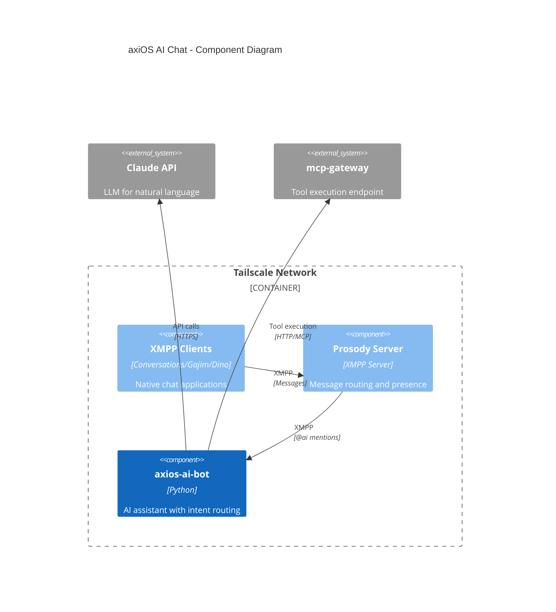

# axiOS AI Chat

Family XMPP chat with AI assistant for the axios ecosystem.

## Overview

A family-oriented XMPP chat system with an integrated AI assistant, designed for the axios ecosystem. Like a private AIM, but only accessible within your Tailscale network, with an AI bot that can manage email, calendar, contacts, and more through MCP tools.

**Repository:** [kcalvelli/axios-ai-chat](https://github.com/kcalvelli/axios-ai-chat)

## Architecture



**Key Features:**
- **Private Family Messenger** - Accessible only within your Tailscale network
- **AI Assistant** - Chat with `@ai` to manage email, calendar, contacts
- **Native Clients** - Works with Conversations (Android), Gajim (Windows/Linux), Dino (Linux)
- **Dynamic Tool Discovery** - New MCP servers added to mcp-gateway are automatically available
- **Cost-Optimized** - Uses Haiku for intent classification, Sonnet for tool execution

## Onboarding

### Prerequisites
- NixOS with flakes enabled
- Tailscale configured
- mcp-gateway running

### Installation

Add to your `flake.nix`:

```nix
{
  inputs.axios-chat.url = "github:kcalvelli/axios-chat";

  outputs = { self, nixpkgs, axios-chat, ... }: {
    nixosConfigurations.myhost = nixpkgs.lib.nixosSystem {
      modules = [
        axios-chat.nixosModules.default
        ./configuration.nix
      ];
    };
  };
}
```

### Configuration

```nix
services.axios-chat = {
  prosody = {
    enable = true;
    domain = "chat.home.ts.net";
    tailscaleIP = "100.64.0.1";
  };
  bot = {
    enable = true;
    xmppDomain = "chat.home.ts.net";
    xmppPasswordFile = config.age.secrets.ai-bot-password.path;
    anthropicKeyFile = config.age.secrets.anthropic-key.path;
    mcpGatewayUrl = "http://localhost:8085";
  };
};
```

## Release History

No releases yet.
