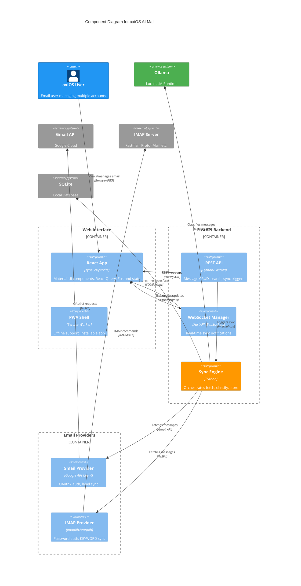

# axiOS AI Mail

**AI-powered inbox organizer with local LLM classification for axiOS/NixOS**

[View on GitHub](https://github.com/kcalvelli/axios-ai-mail)

## Overview

axiOS AI Mail is a declarative email management system that combines direct provider integration (Gmail, IMAP) with local AI classification to automatically organize your inbox. Messages are tagged, prioritized, and organized—all locally, with zero cloud dependencies for AI processing.

**Key Features:**

* **AI-Powered Classification:** Automatically tags messages with categories like `work`, `finance`, `personal`, `shopping` using local LLMs via Ollama
* **Multi-Account Support:** Manage Gmail (OAuth2) and IMAP accounts from a single interface
* **Modern Web UI:** Responsive React interface with Material-UI, dark mode, and PWA support
* **Mobile-Optimized:** Touch gestures, swipe actions, and responsive design for mobile devices
* **Keyboard Navigation:** Full keyboard shortcut support (j/k navigation, quick actions)
* **Real-Time Sync:** WebSocket-based live updates across all connected clients
* **Bulk Operations:** Select multiple messages for batch actions with undo support
* **Declarative Config:** Define everything in Nix—accounts, AI settings, custom tags

**Note:** This application is designed for axiOS users and assumes axiOS conventions (agenix for secrets, `~/.config/nixos_config` for configuration).

## Architecture

The application follows a layered architecture with clear separation between the React frontend, FastAPI backend, email providers, and AI classification engine.



**Architectural Assumptions:**

* **Nix-Centric Design:** Configuration is declarative via Home Manager module, generating runtime config at build time
* **Provider Abstraction:** BaseEmailProvider interface allows adding new providers (Outlook planned) without changing core logic
* **Local-First AI:** All classification runs via Ollama on local hardware, no cloud API calls for AI
* **SQLite Storage:** Messages and tags stored in local SQLite database with full-text search
* **Real-Time Architecture:** WebSocket broadcasts sync events to all connected clients for instant updates
* **Secret Management:** OAuth tokens and passwords managed via agenix/sops-nix, never stored in plaintext

## Onboarding

### Prerequisites

1. **axiOS or NixOS with Home Manager** - Nix-native application
2. **Ollama** - For local AI classification (`ollama pull llama3.2`)
3. **Google Cloud OAuth credentials** (for Gmail accounts)

### Installation

Add to your flake inputs:

```nix
{
  inputs.axios-ai-mail.url = "github:kcalvelli/axios-ai-mail";
}
```

Enable in Home Manager:

```nix
{ config, ... }:
{
  imports = [ inputs.axios-ai-mail.homeManagerModules.default ];

  programs.axios-ai-mail = {
    enable = true;

    ai = {
      model = "llama3.2";
      endpoint = "http://localhost:11434";
    };

    accounts.gmail = {
      provider = "gmail";
      email = "you@gmail.com";
      oauthTokenFile = config.age.secrets.gmail-token.path;
    };
  };
}
```

### Usage

```bash
# Sync messages from all accounts
axios-ai-mail sync run

# Start the web interface
axios-ai-mail web
# Open http://localhost:8080

# Gmail OAuth setup wizard
axios-ai-mail auth gmail --account personal
```

### Documentation

* [Quick Start Guide](https://github.com/kcalvelli/axios-ai-mail/blob/main/docs/QUICKSTART.md) - Get running in 15 minutes
* [User Guide](https://github.com/kcalvelli/axios-ai-mail/blob/main/docs/USER_GUIDE.md) - Complete feature documentation
* [Configuration Reference](https://github.com/kcalvelli/axios-ai-mail/blob/main/docs/CONFIGURATION.md) - All Nix options

## Release History

| Version | Date | Status |
| :--- | :--- | :--- |
| - | - | No releases yet |
