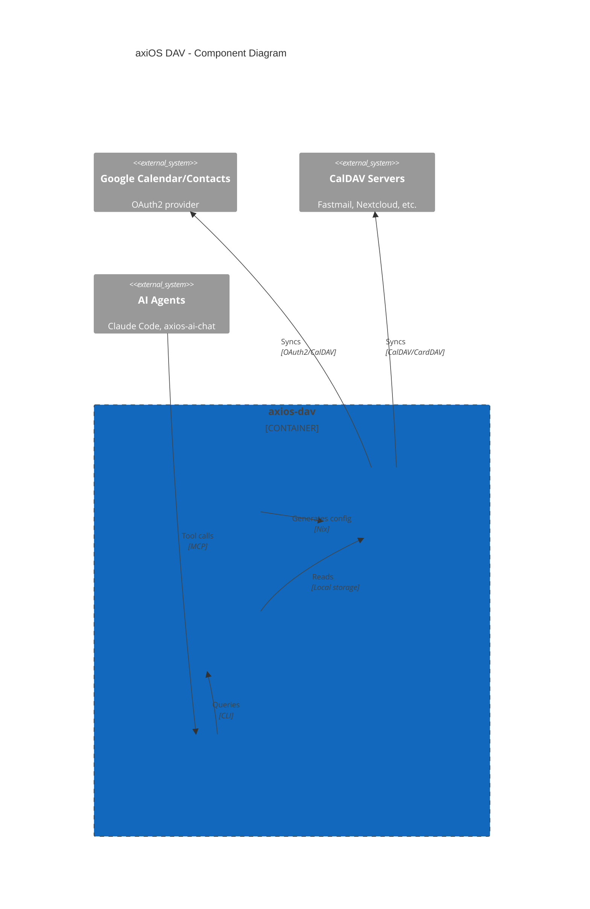

# axiOS DAV

Declarative CalDAV/CardDAV sync for NixOS with MCP integration.

## Overview

axios-dav provides declarative CalDAV/CardDAV synchronization for NixOS, with first-class Google Calendar support and an MCP server for AI agents to read/create calendar events and search contacts.

**Repository:** [kcalvelli/axios-dav](https://github.com/kcalvelli/axios-dav)

## Architecture



**Key Features:**
- **Declarative Configuration** - No manual config files; everything in Nix
- **Google Calendar & Contacts** - First-class OAuth support
- **CalDAV/CardDAV** - Works with any standard provider (Fastmail, Nextcloud, etc.)
- **HTTP/ICS Subscriptions** - Read-only calendar feeds (holidays, sports, etc.)
- **MCP Server** - AI agents can read/create calendar events and search contacts

## Onboarding

### Installation

Add to your `flake.nix`:

```nix
{
  inputs.axios-dav.url = "github:kcalvelli/axios-dav";

  outputs = { self, nixpkgs, home-manager, axios-dav, ... }: {
    nixosConfigurations.myhost = nixpkgs.lib.nixosSystem {
      modules = [
        axios-dav.nixosModules.default
        home-manager.nixosModules.home-manager
      ];
    };
  };
}
```

### Configuration

```nix
services.pim.calendar = {
  enable = true;
  defaultCalendar = "Family";

  accounts = {
    google = {
      type = "google";
      tokenFile = "/home/youruser/.vdirsyncer/google_token.json";
      clientId = "your-client-id.apps.googleusercontent.com";
      clientSecretFile = "/run/agenix/google-client-secret";
    };
  };

  sync = {
    frequency = "5m";
    conflictResolution = "remote";
  };
};
```

### Initial Setup

```bash
# Discover and authorize calendars
vdirsyncer discover

# Initial sync
vdirsyncer sync

# Verify with khal
khal list
```

## Release History

No releases yet.
