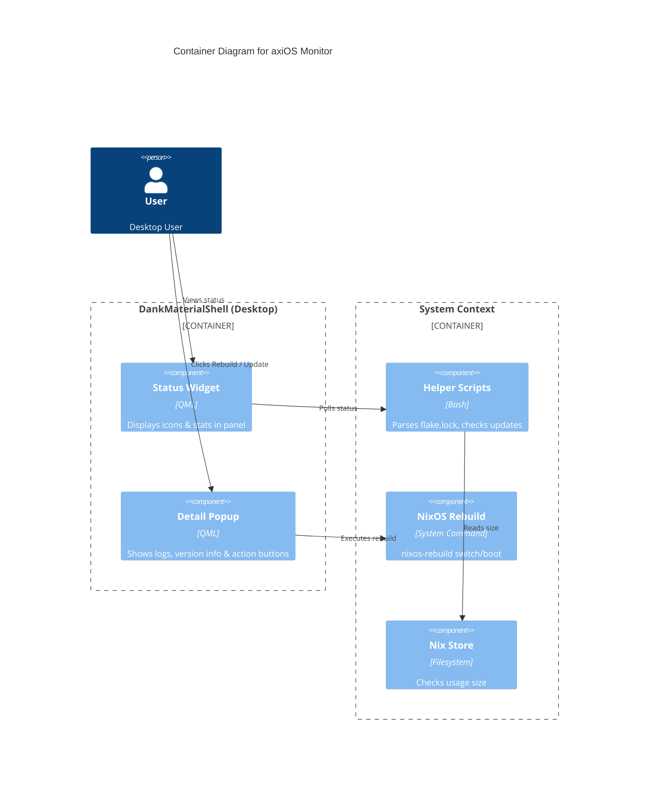

# axiOS Monitor

**A DMS plugin for monitoring and managing axiOS systems.**

[View on GitHub](https://github.com/kcalvelli/axios-monitor)

## Overview

A plugin for [DankMaterialShell](https://danklinux.com/) specifically designed for axiOS. It allows users to monitor system generations, check for updates, and trigger system rebuilds directly from the desktop UI.

## Architecture

The plugin acts as a frontend for system management tasks, interacting with the Nix store and system rebuild commands.



## Onboarding

If you are using axiOS with the desktop module enabled, this plugin is **automatically configured**.

For manual installation (on axiOS), add to your home-manager config:
```nix
programs.axios-monitor.enable = true;
```

## Release History

| Version | Date | Status |
| :--- | :--- | :--- |
| - | - | No releases found |