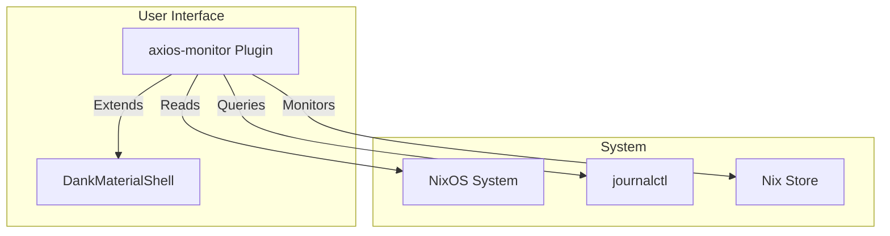

# Axios Monitor

**Repo:** [kcalvelli/axios-monitor](https://github.com/kcalvelli/axios-monitor)

A DankMaterialShell (DMS) plugin for monitoring and managing NixOS systems. It provides visual feedback and control integration directly into the shell environment.

## Architecture

This component diagram shows how `axios-monitor` integrates with the shell and system.



## Onboarding

To use this plugin, you typically include it in your DMS configuration.

**Flake Input:**
```nix
inputs.axios-monitor.url = "github:kcalvelli/axios-monitor";
```

## Latest Status

**Release:** *No official release yet (Rolling)*
**Source:** Main branch
