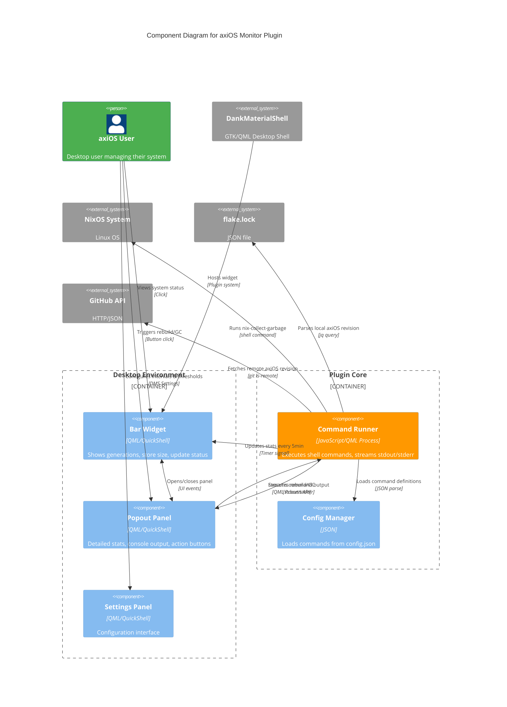

# axiOS Monitor

**DMS plugin for monitoring and managing axiOS systems**

[View on GitHub](https://github.com/kcalvelli/axios-monitor)

## Overview

axiOS Monitor is a [DankMaterialShell](https://danklinux.com/) plugin exclusively designed for axiOS systems. It provides integrated rebuild and update tracking capabilities directly from the desktop shell. This is a fork of [nix-monitor](https://github.com/antonjah/nix-monitor) by Anton Andersson, with significant axiOS-specific modifications.

**Key Features:**

* **Dual Rebuild Buttons:** Separate "Rebuild Switch" (immediate activation) and "Rebuild Boot" (activate on next boot) actions
* **axiOS Version Tracking:** Monitors axiOS library version from flake.lock instead of nixpkgs
* **Zero Configuration:** Automatically configured when using axiOS desktop module
* **Real-time Console:** View nixos-rebuild output as it runs
* **Update Status:** Visual indicators (green/yellow/red) for axiOS update availability
* **System Statistics:** Monitor NixOS generations count and Nix store size with configurable warnings
* **Garbage Collection:** Trigger nix-collect-garbage directly from the UI

**Note:** This plugin is exclusively designed for axiOS and will NOT work with standard NixOS installations.

## Architecture

The plugin operates as a QML-based desktop widget that bridges user interactions with system-level Nix operations. It uses configurable shell commands to interface with NixOS, flake management, and GitHub APIs for version tracking.



**Architectural Assumptions:**

* **QML Plugin Architecture:** Built as a QuickShell plugin loaded by DankMaterialShell at runtime via plugin.json manifest
* **Command-based Integration:** All system interactions happen through configurable shell commands (defined in config.json) rather than direct Nix library calls
* **Three-layer UI:** Bar widget for glanceable status, popout panel for detailed operations, and DMS settings integration for configuration
* **Process-based Execution:** Uses QML Process component to spawn shell commands, capture stdout/stderr in real-time, and stream to console widget
* **Flake-centric Design:** Assumes axiOS configuration is a flake with axios as an input, reads flake.lock for local version, uses git ls-remote for remote version
* **Auto-configuration:** axiOS desktop module automatically generates config.json with proper commands (`$FLAKE_PATH` detection, hostname interpolation)
* **No Standalone Operation:** Requires DankMaterialShell plugin system and QuickShell runtime, cannot run independently

## Onboarding

### For axiOS Users (Automatic)

If you're using axiOS with the desktop module enabled (`modules.desktop = true`), **this plugin is automatically configured** - no additional setup required!

The plugin is included as part of the axiOS desktop module and will:

* Auto-detect your flake location via `$FLAKE_PATH` or default to `~/.config/nixos_config`
* Configure rebuild commands matching axiOS fish functions
* Track axiOS library version for updates
* Enable all features with sensible defaults

Simply rebuild your system and the widget will appear in DMS.

### Activation Steps

1. Rebuild your axiOS configuration: `sudo nixos-rebuild switch`
2. Restart DMS: `dms restart` (or log out and back in)
3. Open DMS Settings → Plugins
4. Click "Scan for Plugins"
5. Toggle "axiOS Monitor" ON
6. Add to your DankBar layout

### Updating the Plugin

The plugin updates automatically when you update your axiOS flake input:

```bash
# Update axiOS (includes axios-monitor)
nix flake update axios

# Rebuild
sudo nixos-rebuild switch

# Clear QML cache and restart DMS
rm -rf ~/.cache/quickshell/qmlcache/
dms restart
```

**Note:** Due to QML disk caching with Nix symlinks, you must clear the QML cache after plugin updates for changes to take effect.

### Manual Configuration (Advanced)

If you need custom configuration, you can override the defaults in your home-manager configuration:

```nix
{
  programs.axios-monitor = {
    enable = true;

    # Override rebuild commands if needed
    rebuildCommand = [
      "bash" "-c"
      ''
        FLAKE_PATH=''${FLAKE_PATH:-~/.config/nixos_config}
        sudo nixos-rebuild switch --flake "$FLAKE_PATH#$(hostname)" 2>&1
      ''
    ];

    rebuildBootCommand = [
      "bash" "-c"
      ''
        FLAKE_PATH=''${FLAKE_PATH:-~/.config/nixos_config}
        sudo nixos-rebuild boot --flake "$FLAKE_PATH#$(hostname)" 2>&1
      ''
    ];

    # Customize update interval
    updateInterval = 300; # 5 minutes
  };
}
```

## Release History

| Version | Date | Status |
| :--- | :--- | :--- |
| - | - | No releases found |
