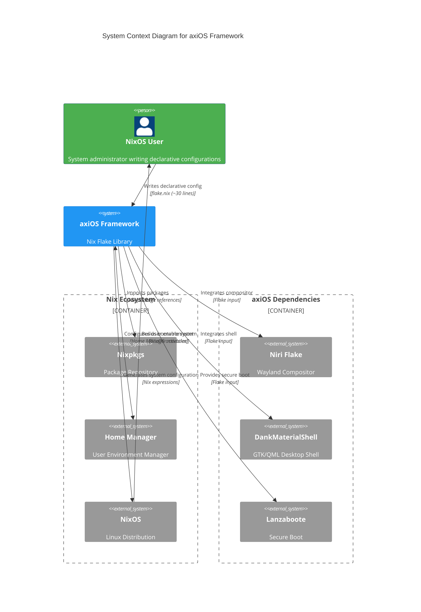

# axiOS

**A modular NixOS distribution**

[View on GitHub](https://github.com/kcalvelli/axios)

## Overview

axiOS is a **NixOS framework and library** that you import into your own flake to build NixOS configurations. Think of it as a curated collection of modules, packages, and home-manager configs that work together seamlessly. You maintain just a few simple files (~30 lines), and axios provides everything else: desktop environment, development tools, system configuration, and more.

**Key Features:**

* **Desktop Experience:** Niri scrollable tiling compositor with workspace overview, DankMaterialShell with Material Design widgets, Ghostty GPU-accelerated terminal, automatic GPU hardware acceleration (AMD/NVIDIA)
* **Development:** Multi-language environments (Rust, Zig, Python, Node.js) with LSP support, project-specific DevShells, organized development tools
* **Infrastructure:** Declarative disk management (Disko), Secure Boot (Lanzaboote), Virtualization (libvirt, QEMU, Podman), Hardware optimization (desktop/laptop)
* **Applications:** 80+ curated applications, PWAs integrated as native apps, GNOME Software with Flathub pre-configured
* **Workflow Philosophy:** Focused, distraction-free single-monitor workflow with maximized windows by default, strategic floating utilities, and instant dropdown terminal (Super+`)

## Architecture

axiOS operates as a declarative configuration framework that sits between the user and NixOS, transforming simple configuration files into complete system builds. The architecture emphasizes the declarative flow from user intent to system realization.



**Architectural Assumptions:**

* **Declarative Flow:** Users write minimal configuration files (flake.nix, user.nix, hardware.nix totaling ~60 lines), and axiOS expands these into complete NixOS system configurations
* **Library Design:** axiOS exports `axios.lib.mkSystem` function that accepts structured parameters (hostname, formFactor, hardware, modules, user/hardware paths) and returns a complete NixOS configuration
* **Modular Composition:** Framework pulls together multiple specialized inputs (Niri compositor, DankMaterialShell, Lanzaboote) and presents them as cohesive, pre-integrated modules
* **Separation of Concerns:** User configs remain simple and portable, while framework handles complexity of integrating 80+ applications, multiple desktop environments, and hardware-specific optimizations
* **Flake-based Distribution:** Entire framework is distributed as a Nix flake with locked dependencies, allowing users to pin specific versions or update selectively

## Onboarding

**Prerequisites:** NixOS installed in UEFI mode (BIOS/MBR not supported)

### Interactive Generator (Recommended)

The fastest way to get started is using the interactive generator:

```bash
mkdir ~/my-nixos-config && cd ~/my-nixos-config
nix run --refresh --extra-experimental-features "nix-command flakes" github:kcalvelli/axios#init
```

The generator creates a complete configuration tailored to your system in minutes.

### Manual Configuration

For manual setup, you'll create just 3 files:

* `flake.nix` - Import axios and configure your system (~30 lines)
* `user.nix` - Your user account settings (~15 lines)
* `hardware.nix` - Hardware configuration from nixos-generate-config

### Building and Deploying

Once configured, build and deploy your system:

```bash
# Build the configuration
nix build .#nixosConfigurations.your-hostname.config.system.build.toplevel

# Deploy to your system
sudo nixos-rebuild switch --flake .#your-hostname
```

### Additional Resources

* [Installation Guide](https://github.com/kcalvelli/axios/blob/master/docs/INSTALLATION.md) - Complete step-by-step instructions
* [Library API Reference](https://github.com/kcalvelli/axios/blob/master/docs/LIBRARY_USAGE.md) - Using `axios.lib.mkSystem`
* [Application Catalog](https://github.com/kcalvelli/axios/blob/master/docs/APPLICATIONS.md) - See what's included
* [Adding Multiple Hosts](https://github.com/kcalvelli/axios/blob/master/docs/ADDING_HOSTS.md) - Multi-host setups

## Release History

| Version | Date | Status |
| :--- | :--- | :--- |
| v2025.12.11 | 2025-12-11 | ✅ Latest |
| v2025.12.04 | 2025-12-04 | |
| v2025.11.21 | 2025-11-21 | |
| v2025.11.19 | 2025-11-19 | |
| v2025.11.18 | 2025-11-18 | |
| v2025.11.13 | 2025-11-13 | |
| 2025-11-08.1 | 2025-11-08 | |
| v2025.11.08 | 2025-11-08 | |
| 2025-11-04 | 2025-11-04 | |
| 2025.10.30 | 2025-10-30 | |
| 2025-10-27 | 2025-10-27 | |
| 2025.10.25 | 0001-01-01 | |
| 2025.10.25 | 0001-01-01 | |
