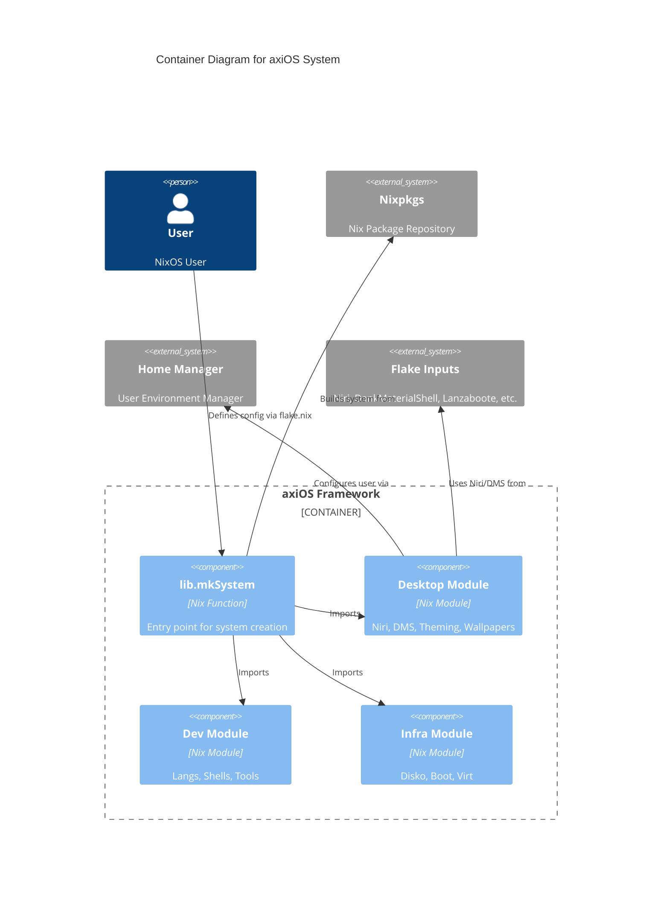

# axiOS

**A modular NixOS framework and library for building reproducible systems.**

[View on GitHub](https://github.com/kcalvelli/axios)

## Overview

axiOS is a **NixOS framework and library** that you import into your own flake to build NixOS configurations. It acts as a curated collection of modules, packages, and home-manager configs that work together to provide a polished desktop experience (Niri, DankMaterialShell), development tools, and system configuration.

Key features include:
*   **Desktop Experience:** Niri compositor, DankMaterialShell, Ghostty terminal, and GPU acceleration.
*   **Development:** Multi-language environments (Rust, Zig, Python, Node.js) and DevShells.
*   **Infrastructure:** Declarative disks, Secure boot (Lanzaboote), and Virtualization.

## Architecture

axiOS functions as a library that composes various inputs into a cohesive system configuration.



The system is designed as a library (`axios.lib.mkSystem`) rather than a monolithic config, allowing for high modularity and customization.

## Onboarding

To get started with a new configuration:

```bash
mkdir ~/my-nixos-config && cd ~/my-nixos-config
nix run --refresh --extra-experimental-features "nix-command flakes" github:kcalvelli/axios#init
```

For manual setup, you typically create:
*   `flake.nix` (imports axios)
*   `user.nix` (user settings)
*   `hardware.nix` (hardware config)

See [docs/INSTALLATION.md](https://github.com/kcalvelli/axios/blob/master/docs/INSTALLATION.md) in the repo for details.

## Release History

| Version | Date | Status |
| :--- | :--- | :--- |
| v2025.12.11 | 2025-12-11 | ✅ Latest |
| v2025.12.04 | 2025-12-04 | |
| v2025.11.21 | 2025-11-21 | |
| v2025.11.19 | 2025-11-19 | |
| v2025.11.18 | 2025-11-18 | |
| v2025.11.13 | 2025-11-13 | |
| 2025-11-08.1 | 2025-11-08 | |
| v2025.11.08 | 2025-11-08 | |
| 2025-11-04 | 2025-11-04 | |
| 2025.10.30 | 2025-10-30 | |
| 2025-10-27 | 2025-10-27 | |
| 2025.10.25 | 0001-01-01 | |
| 2025.10.25 | 0001-01-01 | |