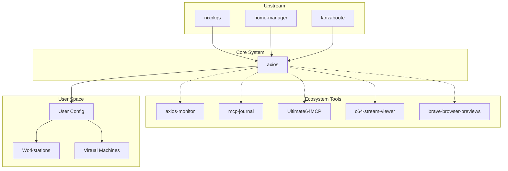

# Axios Library

**Repo:** [kcalvelli/axios](https://github.com/kcalvelli/axios)

A modular NixOS distribution designed for flexibility and ease of use. It provides a structured way to manage NixOS configurations with a focus on VM support and developer tooling.

## Architecture

This diagram illustrates how `axios` sits at the core of the ecosystem, aggregating upstream dependencies like `nixpkgs` and `home-manager` while providing modules for downstream user configurations and ecosystem tools.



**Key Components:**
- **Flake Structure:** Uses `flake-parts` for modularity.
- **Modules:** Custom NixOS modules located in `modules/`.
- **Packages:** Custom packages (like overlays) in `pkgs/`.
- **DevShells:** Pre-configured environments for developers.

## Onboarding

To start using axiOS for a new configuration:

```bash
nix run --refresh github:kcalvelli/axios#init
```

For existing users, update your input:

```bash
nix flake lock --update-input axios
```

### Dev Shells
The project provides several development shells. Check `devshells.nix` or running `nix develop` in the root.

## Latest Status

**Version:** v2025.12.11  
**Published:** 2025-12-11

### Highlights
- **VM Support Fixed:** Now works correctly in QEMU/KVM, VMware, and VirtualBox.
- **Simplified Hardware Config:** New `hardwareConfigPath` option.
- **Backward Compatible:** Existing configurations continue to work.

> **Note:** axiOS requires UEFI boot mode.
