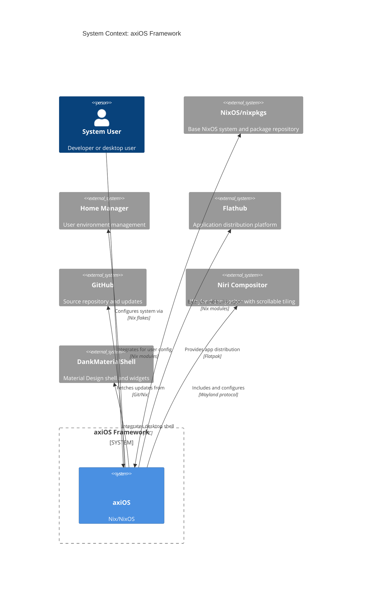

# Axios Library

## Overview

**axiOS** is a modular NixOS framework and library designed for building reproducible systems with curated desktop environments, development tools, and modern workflows. It follows a library design philosophy, allowing users to import it into their own flakes and maintain minimal configuration while benefiting from a full-featured system.

**Repository:** [kcalvelli/axios](https://github.com/kcalvelli/axios)

## Architecture



### Architectural Assumptions

axiOS is designed as a **framework/library** rather than a personal configuration:

1. **Modular Architecture**: Users import axios into their flake and enable only needed features through the `modules` configuration
2. **Minimal User Config**: Users maintain ~30 lines of configuration while axios provides the complete system
3. **Multi-layer Integration**: Combines NixOS system modules, Home Manager user configs, and external applications (via Flathub)
4. **External Dependencies**: Relies on established ecosystem projects (nixpkgs, home-manager, niri, etc.) rather than reimplementing functionality
5. **Update Flexibility**: Users control when to update via `nix flake update`, allowing version pinning for stability

The diagram shows axiOS as a central framework that orchestrates these external systems to provide a cohesive desktop and development experience.

## Onboarding

### Prerequisites

- NixOS installed in UEFI mode (BIOS/MBR not supported)
- Git installed
- Nix flakes and commands enabled

### Quick Start with Interactive Generator (Recommended)

```bash
mkdir ~/my-nixos-config && cd ~/my-nixos-config
nix run --refresh --extra-experimental-features "nix-command flakes" github:kcalvelli/axios#init
```

The `--refresh` flag ensures you get the latest version.

### Manual Setup

Create three files:

1. **flake.nix** (~30 lines) - Import axios and configure your system
2. **user.nix** (~15 lines) - Your user account settings
3. **hardware.nix** - Hardware configuration from `nixos-generate-config`

Example `flake.nix`:

```nix
{
  inputs = {
    nixpkgs.url = "github:NixOS/nixpkgs/nixpkgs-unstable";
    axios.url = "github:kcalvelli/axios";
  };

  outputs = { self, nixpkgs, axios }: {
    nixosConfigurations.myhost = axios.lib.mkSystem {
      hostname = "myhost";
      formFactor = "desktop";  # or "laptop"
      hardware = { cpu = "amd"; gpu = "amd"; };
      modules = { desktop = true; development = true; };
      userModulePath = ./user.nix;
      hardwareConfigPath = ./hardware.nix;
    };
  };
}
```

### Building and Deploying

```bash
# Build the system
nix build .#nixosConfigurations.myhost.config.system.build.toplevel

# Switch to the new configuration
sudo nixos-rebuild switch --flake .#myhost
```

### Installing Additional Applications

**Use Flathub (Recommended)**: Open GNOME Software and install applications from Flathub for sandboxed, independently-updating apps.

**Declarative Packages**: Add packages to `extraConfig` in your host configuration for system-level tools and CLI utilities.

For complete installation instructions, see the [Installation Guide](https://github.com/kcalvelli/axios/blob/main/docs/INSTALLATION.md).

## Release History

| Version | Date | Status |
|---------|------|--------|
| v2025.12.11 | 2025-12-11 | ✅ Latest |
| v2025.12.04 | 2025-12-04 | |
| v2025.11.21 | 2025-11-21 | |
| v2025.11.19 | 2025-11-19 | |
| v2025.11.18 | 2025-11-18 | |
| v2025.11.13 | 2025-11-13 | |
| 2025-11-08.1 | 2025-11-08 | |
| v2025.11.08 | 2025-11-08 | |
| 2025-11-04 | 2025-11-04 | |
| 2025.10.30 | 2025-10-30 | |
| 2025-10-27 | 2025-10-27 | |
| 2025.10.25 | N/A | |
| 2025.10.25 | N/A | |
