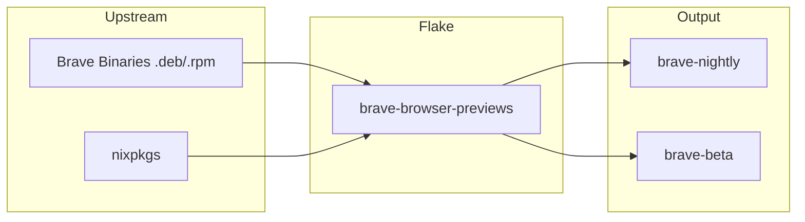

# Brave Browser Previews

**Repo:** [kcalvelli/brave-browser-previews](https://github.com/kcalvelli/brave-browser-previews)

Provides Nix flake outputs for Brave Browser Nightly and Beta builds. This allows users to run bleeding-edge versions of Brave on NixOS without waiting for upstream `nixpkgs` updates.

## Architecture



## Onboarding

Run the browser directly:

```bash
nix run github:kcalvelli/brave-browser-previews#brave-nightly
# or
nix run github:kcalvelli/brave-browser-previews#brave-beta
```

## Latest Status

**Release:** *Rolling updates tracking upstream Brave releases*
