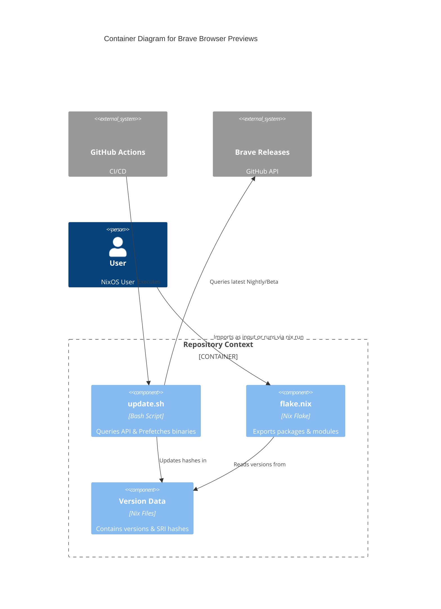

# Brave Browser Previews

**A Nix Flake that provides the latest Nightly and Beta versions of Brave Browser for Linux.**

[View on GitHub](https://github.com/kcalvelli/brave-browser-previews)

## Overview

This repository provides an automated way to get the latest **Brave Nightly** and **Brave Beta** builds on NixOS. It is automatically updated daily to track official Brave GitHub releases. It includes both a NixOS module for declarative configuration and standalone packages.

## Architecture

This project relies on GitHub Actions to automate the fetching of upstream binaries and updating of the Nix flake.



## Onboarding

You can run the browsers directly without installation:

```bash
# Run Nightly
nix run github:kcalvelli/brave-browser-previews#brave-nightly

# Run Beta
nix run github:kcalvelli/brave-browser-previews#brave-beta
```

For NixOS installation, add it as a flake input and import the module. See the [README](https://github.com/kcalvelli/brave-browser-previews) for details.

## Release History

| Version | Date | Status |
| :--- | :--- | :--- |
| - | - | No releases found |