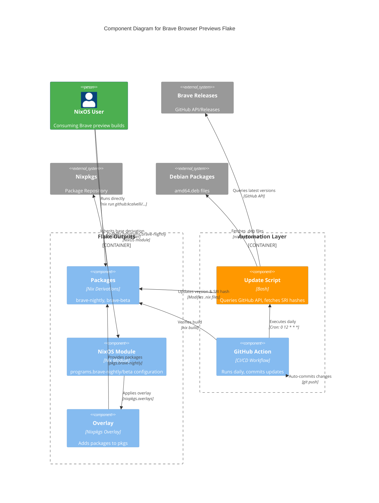

# Brave Browser Previews

**Preview management extension for Brave Browser**

[View on GitHub](https://github.com/kcalvelli/brave-browser-previews)

## Overview

A **Nix Flake** that provides the latest **Nightly** and **Beta** versions of Brave Browser for Linux (`x86_64-linux`). This repository is automatically updated daily to track the official [Brave GitHub Releases](https://github.com/brave/brave-browser/releases).

**Key Features:**

* **Automated Updates:** GitHub Action runs daily to fetch the latest versions and SRI hashes directly from Brave's release API
* **Two Channels:** brave-nightly (bleeding-edge with AI features enabled) and brave-beta (beta channel)
* **Pure Flake:** Designed to be easily consumed as a flake input in NixOS or Home Manager configurations
* **NixOS Module:** Exports a module allowing configuration similar to `programs.chromium`
* **Ad-hoc Usage:** Can run browsers directly via `nix run` without installation

**Note:** Brave Nightly is enabled with `--enable-features=BraveAIChatAgentProfile` by default for AI Agent testing.

## Architecture

This flake functions as an automated packaging pipeline that bridges Brave's binary releases with the Nix ecosystem. It continuously monitors upstream releases, packages them with proper Nix derivations, and exposes them through multiple consumption patterns.



**Architectural Assumptions:**

* **Continuous Packaging:** GitHub Actions workflow runs daily at 12:00 UTC, automatically detecting and packaging new Brave releases without manual intervention
* **Two-stage Update Process:** Update script first queries GitHub API for latest release metadata, then uses `nix-prefetch-url` to compute SRI hashes for .deb assets before modifying package definitions
* **Binary Wrapping:** Packages don't compile Brave from source; instead they extract .deb files and wrap binaries with Nix-provided dependencies (similar to upstream nixpkgs chromium approach)
* **Multi-consumption Pattern:** Single flake provides three consumption methods: direct packages (environment.systemPackages), NixOS modules (programs.brave-nightly), and overlays (for custom pkgs)
* **Flake Purity:** All inputs locked in flake.lock; users can pin specific commits for stability or track master branch for continuous updates
* **Channel Separation:** Nightly and Beta are completely independent derivations, allowing users to install one or both simultaneously without conflicts

## Onboarding

### Direct Execution (No Installation)

You can run the browsers directly without installing them:

```bash
# Run Nightly
nix run github:kcalvelli/brave-browser-previews#brave-nightly

# Run Beta
nix run github:kcalvelli/brave-browser-previews#brave-beta
```

### NixOS Configuration

#### Step 1: Add Flake Input

Add this repository to your `flake.nix` inputs:

```nix
{
  inputs = {
    nixpkgs.url = "github:nixos/nixpkgs/nixos-unstable";

    brave-previews.url = "github:kcalvelli/brave-browser-previews";

    # Recommended: Follow your system's nixpkgs to avoid duplicate store paths
    brave-previews.inputs.nixpkgs.follows = "nixpkgs";
  };

  outputs = { self, nixpkgs, brave-previews, ... }: {
    # Your configuration
  };
}
```

#### Step 2: Use NixOS Module

Configure Brave Nightly similar to `programs.chromium`:

```nix
{ pkgs, brave-previews, ... }:

{
  imports = [
    brave-previews.nixosModules.default
  ];

  programs.brave-nightly = {
    enable = true;
    extensions = [
      "cjpalhdlnbpafiamejdnhcphjbkeiagm" # uBlock Origin
    ];
    defaultSearchProviderSearchURL = "https://search.brave.com/search?q={searchTerms}";
  };

  # You can also configure Beta independently
  programs.brave-beta.enable = true;
}
```

#### Step 3: Install as Package (Alternative)

If you just want the packages without the configuration module:

```nix
{ pkgs, brave-previews, ... }:

{
  environment.systemPackages = [
    brave-previews.packages.${pkgs.system}.brave-nightly
  ];
}
```

### Home Manager

In your `home.nix`:

```nix
{ pkgs, brave-previews, ... }:

{
  home.packages = [
    brave-previews.packages.${pkgs.system}.brave-nightly
  ];
}
```

## Release History

| Version | Date | Status |
| :--- | :--- | :--- |
| - | - | No releases found |
