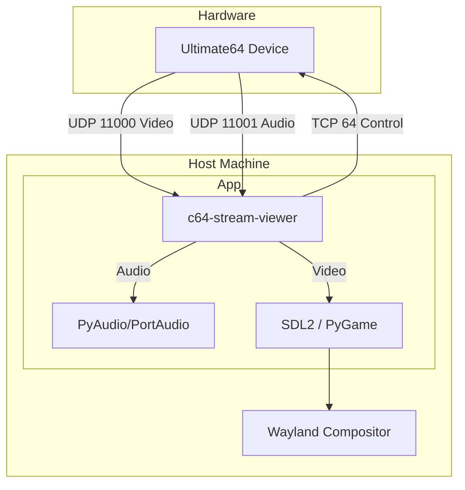

# C64 Stream Viewer

**Repo:** [kcalvelli/c64-stream-viewer](https://github.com/kcalvelli/c64-stream-viewer)

A Wayland-native video and audio viewer for the Ultimate64 Commodore 64 implementation. It decodes proprietary UDP streams to display C64 video and audio on your modern desktop.

## Architecture



## Onboarding

**Try without installing:**
```bash
nix run github:kcalvelli/c64-stream-viewer#av
```

**Variants:**
- `#av`: Audio + Video (Recommended)
- `#video`: Video only
- `#headless`: Stats only

## Latest Status

**Version:** v1.0.0  
**Published:** 2025-12-31

**Features:**
- Native Wayland rendering
- Perfect audio quality (47976 Hz)
- Packet loss detection
