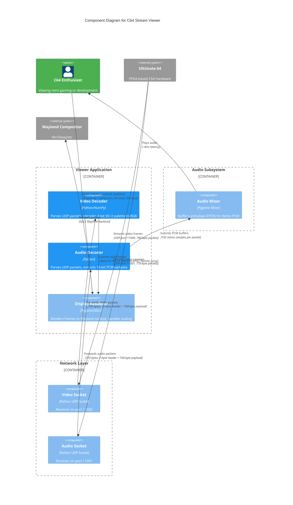

# C64 Stream Viewer

**Wayland-native viewer for Ultimate64 video/audio streaming with VIC-II color conversion**

[View on GitHub](https://github.com/kcalvelli/c64-stream-viewer)

## Overview

A Wayland-native video viewer for Ultimate64 video streaming that decodes the proprietary UDP packet format used by the Ultimate64 device. The application provides real-time video and audio playback with custom decoding for the 4-bit VIC-II color format.

**Key Features:**

* **Native Wayland Rendering:** Uses SDL2/pygame with native Wayland support
* **Custom Packet Decoder:** Decodes Ultimate64's proprietary 4-bit VIC-II color format
* **Real-time Performance:** 14-17 FPS video display with ~4ms audio latency
* **Format Auto-detection:** Supports both PAL (384×272) and NTSC (384×240) resolutions
* **Hardware-accelerated Scaling:** Leverages SDL2 GPU scaling
* **Synchronized Audio:** 16-bit stereo PCM at 47976 Hz with pygame mixer
* **Multiple Modes:** Complete A/V viewer, video-only, headless statistics, and frame capture

## Architecture

The viewer operates as a multi-threaded UDP receiver that decodes proprietary streaming packets from Ultimate64 hardware, converts VIC-II palette data to RGB, and renders synchronized audio/video through Wayland. The architecture separates video and audio processing into independent pipelines.



**Architectural Assumptions:**

* **Dual UDP Stream:** Ultimate64 transmits two independent UDP streams (video on 11000, audio on 11001) that must be received and synchronized by the viewer
* **Proprietary Format:** Video packets use a custom 12-byte header (seq, frame#, line#, dimensions, format) followed by 768 bytes of 4-bit indexed color data (4 lines × 384 pixels × 0.5 bytes)
* **VIC-II Palette Conversion:** Each 4-bit value indexes into the classic Commodore 64 VIC-II 16-color palette, which is converted to RGB888 for modern displays
* **Multi-packet Frames:** Single video frames span multiple UDP packets (272÷4 = 68 packets for PAL), requiring frame assembly logic with sequence tracking
* **Audio Interleaving:** Audio payload contains 16-bit signed PCM samples in stereo interleaved format (LRLRLR...), 192 samples per packet = 768 bytes
* **Wayland-first Design:** Explicitly sets SDL_VIDEODRIVER=wayland and uses pygame with SDL2 backend for native Wayland protocol support
* **Three Execution Modes:** Complete A/V viewer (default), video-only (lightweight), headless (statistics/capture) - all sharing core decoder logic

## Onboarding

### Quick Start - Run Without Installation

Try the viewer directly without installing:

```bash
# Complete A/V viewer (recommended)
nix run github:kcalvelli/c64-stream-viewer#av

# Video-only viewer (lightweight)
nix run github:kcalvelli/c64-stream-viewer#video

# Headless mode (statistics only)
nix run github:kcalvelli/c64-stream-viewer#headless
```

### NixOS System Installation

Add as a flake input to your NixOS configuration. In your `flake.nix`:

```nix
{
  inputs = {
    nixpkgs.url = "github:NixOS/nixpkgs/nixos-unstable";
    c64-stream-viewer.url = "github:kcalvelli/c64-stream-viewer";
  };

  outputs = { self, nixpkgs, c64-stream-viewer }: {
    nixosConfigurations.yourhostname = nixpkgs.lib.nixosSystem {
      system = "x86_64-linux";
      modules = [
        ./configuration.nix
        {
          environment.systemPackages = [
            c64-stream-viewer.packages.x86_64-linux.av
            # Optional: Add other variants
            # c64-stream-viewer.packages.x86_64-linux.video
            # c64-stream-viewer.packages.x86_64-linux.headless
          ];
        }
      ];
    };
  };
}
```

Then rebuild your system:

```bash
sudo nixos-rebuild switch --flake .#yourhostname
```

After installation, run from anywhere:

```bash
c64-stream-viewer-av
```

### Development

**Run from cloned repository:**

```bash
cd ~/Projects/c64-stream-viewer
nix run .#av            # Complete A/V viewer
nix run .#video         # Video only
nix run .#headless      # Headless mode
```

**Or enter development shell:**

```bash
nix develop
python c64_stream_viewer_av.py
```

### Usage and Controls

**Complete A/V Viewer Controls:**

* `ESC` or `Q` - Quit
* `F` - Toggle fullscreen
* `M` - Mute/unmute audio

**Command-line Options:**

```bash
python c64_stream_viewer_av.py --help
  --video-port PORT    Video UDP port (default: 11000)
  --audio-port PORT    Audio UDP port (default: 11001)
  --scale N            Display scale factor (default: 2)
  --fullscreen         Start in fullscreen
  --no-audio           Disable audio
```

**Frame Capture Mode:**

```bash
python c64_stream_viewer.py --save-frames /path/to/output
```

Saves frames as PNG files for later viewing or processing.

### Technical Details

**Video Format:**

* **Packet Size:** 780 bytes
* **Header:** 12 bytes (seq, frame#, line#, dimensions, format)
* **Payload:** 768 bytes of 4-bit indexed color data
* **Format:** 4 lines × 384 pixels × 0.5 bytes = 768 bytes
* **Color Palette:** 16-color VIC-II palette (converted to RGB)

**Audio Format:**

* **Packet Size:** 770 bytes
* **Header:** 2 bytes (sequence number)
* **Payload:** 768 bytes = 192 stereo samples
* **Format:** 16-bit signed PCM, stereo, interleaved
* **Sample Rate:** 47976 Hz
* **Latency:** ~4ms per packet

## Release History

| Version | Date | Status |
| :--- | :--- | :--- |
| v1.0.0 | 2025-12-31 | ✅ Latest |
