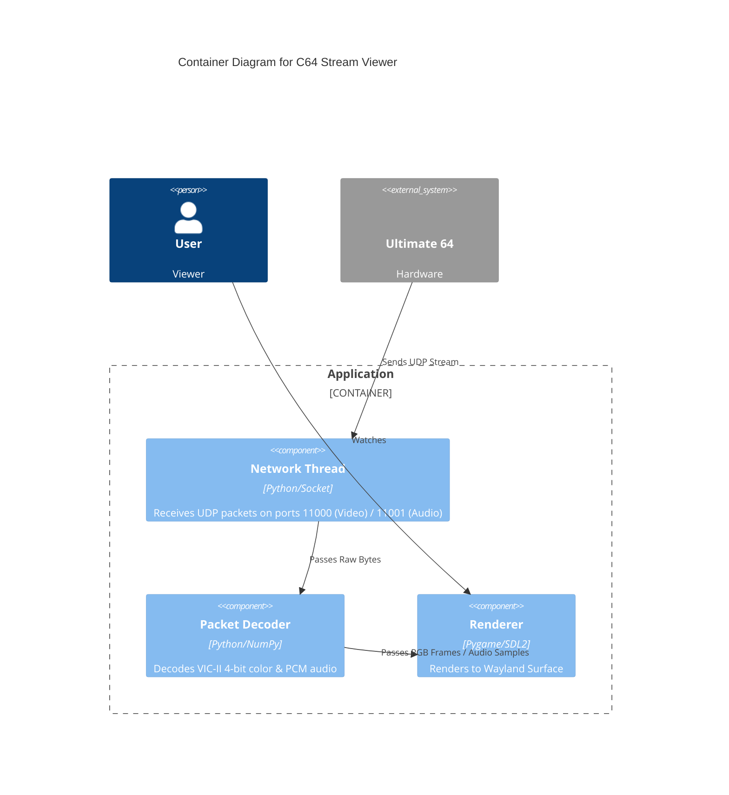

# C64 Stream Viewer

**Wayland-native viewer for Ultimate64 video/audio streaming.**

[View on GitHub](https://github.com/kcalvelli/c64-stream-viewer)

## Overview

A Python-based viewer that decodes proprietary UDP packets from the Ultimate 64 hardware. It features a custom decoder for the 4-bit VIC-II color format and provides low-latency video and audio playback on Wayland systems.

## Architecture

The application is a multi-threaded Python pipeline that processes UDP streams in real-time.



## Onboarding

To run the complete A/V viewer directly:

```bash
nix run github:kcalvelli/c64-stream-viewer#av
```

See the [README](https://github.com/kcalvelli/c64-stream-viewer) for installation and other modes (video-only, headless).

## Release History

| Version | Date | Status |
| :--- | :--- | :--- |
| v1.0.0 | 2025-12-31 | ✅ Latest |