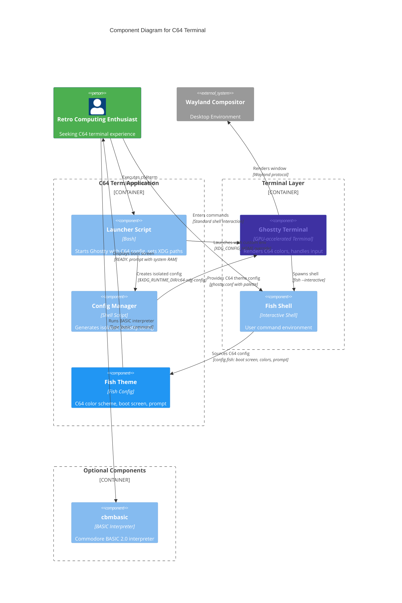

# C64 Terminal

**Terminal for Commodore 64**

[View on GitHub](https://github.com/kcalvelli/c64term)

## Overview

Authentic Commodore 64 terminal experience for modern Linux systems. C64 Term brings the classic C64 aesthetic to your modern terminal with authentic colors, PETSCII palette, boot screen, and blinking cursor - all powered by Ghostty and Fish shell.

**Key Features:**

* **Authentic C64 Colors:** Classic blue background (#3e31a2) and light blue text (#7c70da)
* **Full PETSCII Palette:** Complete 16-color Commodore 64 color scheme
* **C64 Boot Screen:** Shows actual system RAM with "READY." prompt
* **Blinking Cursor:** Classic block cursor █
* **Fish Shell Integration:** Pre-configured with C64 color theme
* **Ghostty Terminal:** Modern GPU-accelerated terminal with C64 configuration
* **BASIC Interpreter:** Includes cbmbasic for authentic BASIC programming

## Architecture

C64 Term functions as a wrapper application that launches Ghostty terminal with a pre-configured C64 theme and Fish shell environment. The architecture separates the terminal emulator (Ghostty), shell configuration (Fish), and optional BASIC interpreter (cbmbasic) into distinct components orchestrated by a launcher script.



**Architectural Assumptions:**

* **Isolated Configuration:** Uses `XDG_RUNTIME_DIR/c64-xdg-config/` to avoid interfering with user's main Ghostty setup, ensuring C64 theme doesn't affect other terminal instances
* **Wrapper Pattern:** Launcher script sets environment variables before executing Ghostty, decoupling C64 theming from terminal emulator
* **Two-layer Theming:** Ghostty provides color palette (16 PETSCII colors), Fish shell provides prompt and boot screen text
* **Stateless Launcher:** Each invocation regenerates isolated config directory, ensuring fresh C64 environment every launch
* **Nix Packaging:** Entire application packaged as a Nix flake with Ghostty, Fish, and cbmbasic as runtime dependencies
* **BASIC Integration:** cbmbasic (Commodore BASIC 2.0 interpreter) included in development shell, accessible via `basic` command
* **GPU Acceleration:** Leverages Ghostty's GPU rendering for smooth terminal experience with C64 aesthetics

## Onboarding

### Quick Start - Run Without Installation

Try C64 Term directly without installing:

```bash
nix run github:kcalvelli/c64term
```

This will launch a Ghostty terminal with the authentic C64 experience.

### NixOS System Installation

Add as a flake input to your NixOS configuration:

```nix
{
  inputs = {
    nixpkgs.url = "github:NixOS/nixpkgs/nixos-unstable";
    c64term.url = "github:kcalvelli/c64term";
  };

  outputs = { self, nixpkgs, c64term, ... }: {
    nixosConfigurations.yourhostname = nixpkgs.lib.nixosSystem {
      system = "x86_64-linux";
      modules = [
        ./configuration.nix
        {
          environment.systemPackages = [
            c64term.packages.x86_64-linux.c64term
          ];
        }
      ];
    };
  };
}
```

Then rebuild your system:

```bash
sudo nixos-rebuild switch --flake .#yourhostname
```

After installation, run from anywhere:

```bash
c64term
```

### Home Manager Installation

In your `home.nix`:

```nix
{
  inputs = {
    c64term.url = "github:kcalvelli/c64term";
  };

  # In your home configuration
  home.packages = [
    inputs.c64term.packages.${pkgs.stdenv.hostPlatform.system}.c64term
  ];
}
```

### Requirements

* **Ghostty** terminal emulator (included in Nix package)
* **Fish** shell (included in Nix package)
* **Linux system** (x86_64 or aarch64)

### Usage

**Launch C64 Terminal:**

```bash
c64term
```

You'll see an authentic C64 boot screen showing your actual system RAM, followed by the classic "READY." prompt.

**Enter BASIC Interpreter:**

```bash
basic
```

**Exit BASIC:**

Type `SYSTEM` or press `Ctrl+C`.

### Configuration

C64 Term runs in an isolated configuration directory to avoid affecting your main Ghostty setup. Configuration is stored in `$XDG_RUNTIME_DIR/c64-xdg-config/`.

### Development

```bash
# Clone the repository
git clone https://github.com/kcalvelli/c64term
cd c64term

# Build the package
nix build

# Run directly
nix run

# Enter development shell with cbmbasic
nix develop
```

## Release History

| Version | Date | Status |
| :--- | :--- | :--- |
| - | - | No releases found |
