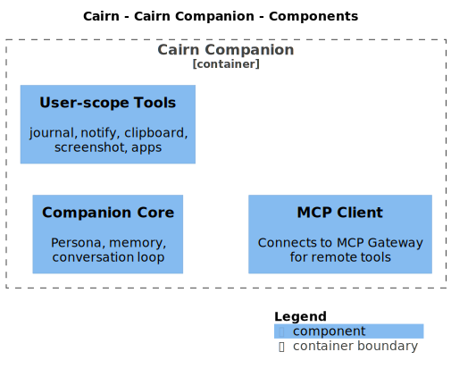

# Cairn Companion

A persistent, customizable persona wrapper around [Claude Code](https://docs.claude.com/en/docs/claude-code). Turn your Claude subscription into an AI agent with identity, memory, and local agency on your Linux machines.

**Repository:** [kcalvelli/cairn-companion](https://github.com/kcalvelli/cairn-companion) · **Language:** Rust

Part of the Cairn ecosystem, but Cairn is not required. Ships as a home-manager module that works on any NixOS system with Claude Code installed.

## What it does

Cairn Companion is a thin wrapper that gives Claude Code three things it doesn't have out of the box:

- **A persistent persona.** Response-format rules, user context, and (optionally) a full character voice that the agent adopts in every session. The agent feels like the same person every time, not a stateless assistant.
- **A home on your filesystem.** A workspace directory for memory, reference data, and long-lived state that the agent can read, write, and evolve across sessions.
- **A path to distributed agency.** Optional tiers add a persistent daemon, channel adapters (Telegram/Discord/email/XMPP), a terminal dashboard, and multi-machine tool routing so the agent can act on whichever machine you're currently using.

It is explicitly **not** a new AI model, not a multi-tenant service, not a replacement for Claude Code. Claude Code does the thinking. This is the thing that makes Claude Code feel like it has a name and remembers you.

## Architecture



## Tiers

| Tier | What you get | What runs |
|------|--------------|-----------|
| **0** — Shell wrapper | `companion` command with persona + workspace pre-loaded | Nothing persistent |
| **1** — Single-machine daemon | Persistent sessions, channel adapters, CLI subcommands, TUI | User-level systemd daemon |
| **2** — Distributed agency | Agent acts on whichever machine the operator is using | Hub daemon + mcp-gateway + companion tool servers per host |

Tier 0 is complete. Most of Tier 1 is live (daemon, D-Bus control plane, streaming, OpenAI-compatible gateway, Rust CLI, ratatui TUI, Telegram/XMPP/email adapters).

## Run it

```nix
# flake.nix
inputs.cairn-companion.url = "github:kcalvelli/cairn-companion";

# home-manager configuration
{
  imports = [ inputs.cairn-companion.homeManagerModules.default ];

  services.cairn-companion = {
    enable = true;
    daemon.enable = true;
    persona.userFile = ./my-user-context.md;
    persona.extraFiles = [ ./my-persona-voice.md ];
  };
}
```

Then from any terminal: `companion`.
