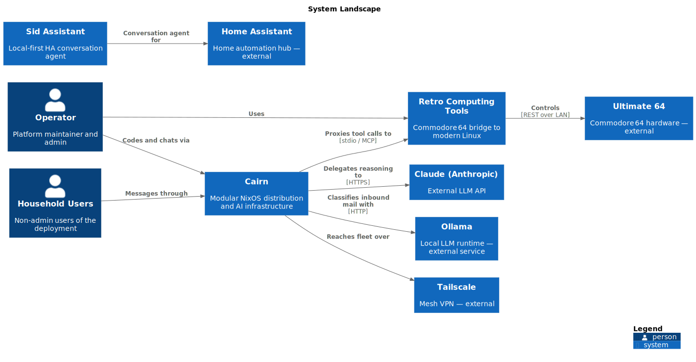

# Keith Calvelli

I build opinionated, self-hosted infrastructure. A NixOS distribution that runs a multi-machine fleet. MCP servers that bridge AI into real systems. A customizable coding agent that runs as a daily driver, not a demo. Everything open source, everything declarative, everything in production — not a lab.

Based in North Carolina. Reachable on [GitHub](https://github.com/kcalvelli).

---

## Featured

### [Cairn](cairn.md) — a modular NixOS distribution

The platform everything else runs on. Declarative system configuration via Nix flakes, with desktop, development, and service modules composable into any host. 14 releases, actively deployed on three machines.

**Nix · NixOS · home-manager**

### [Cairn Companion](cairn-companion.md) — a coding agent with continuity

A persistent, customizable persona wrapper around Claude Code. Named personas, file-based memory that survives between sessions, per-user conversation routing, MCP tool integration. Used every day. Wrote this site.

**Rust · Claude API · MCP**

### [MCP Gateway](mcp-gateway.md) — one door, many tools

Aggregates MCP servers behind a single authenticated HTTP endpoint. Native MCP transport, REST API, dynamic OpenAPI for Open WebUI, OAuth2 for remote clients. The seam where AI meets infrastructure.

**Python · FastAPI · OAuth2 · MCP**

### [Cairn Sentinel](cairn-sentinel.md) — fleet ops over Tailscale

Autonomous monitoring and remote operations for the NixOS fleet. Service health, host telemetry, remote restarts — exposed to AI agents through MCP, routed over a Tailnet.

**Rust · Tailscale · MCP**

---

## The Cairn Ecosystem

Cairn is a galaxy of services that compose into a full platform. This diagram shows what runs where and how the pieces talk.

Source: [`diagrams/cairn.dsl`](https://github.com/kcalvelli/kcalvelli-portal/blob/main/diagrams/cairn.dsl) (Structurizr workspace — one model, many views)

---

## More Work

### Platform & Infrastructure

- **[Cairn Monitor](cairn-monitor.md)** — desktop widget for system status, built as a DMS plugin.
- **[Brave Browser Previews](brave-browser-previews.md)** — Nightly and Beta builds of Brave packaged as Nix flakes.
- **[Nix Voice Assistant](nix-voice-assistant.md)** — NixOS package and module for OHF-Voice/linux-voice-assistant.

### AI & MCP

- **[Sid Assistant](sid-assistant.md)** — local-first Home Assistant conversation agent for any OpenAI-compatible LLM.

### Communication

- **[Cairn Mail](cairn-mail.md)** — self-hosted email with AI-powered classification via local LLMs.
- **[Cairn DAV](cairn-dav.md)** — declarative CalDAV/CardDAV sync with MCP integration.
- **[Cairn Chat](cairn-chat.md)** — multi-user XMPP chat with an AI assistant.

### Retro Computing

- **[Ultimate64 MCP](Ultimate64MCP.md)** — MCP server for the Ultimate 64 series mainboards.
- **[C64 Stream Viewer](c64-stream-viewer.md)** — Wayland-native viewer for Ultimate64 A/V streaming. Released v1.0.0.
- **[C64 Terminal](c64term.md)** — terminal emulator with C64 aesthetic.

### Orthodox & Personal

- **[Orthoterm](orthoterm.md)** — Orthodox Christian liturgical calendar in the terminal.
- **[Diner Placemat](dinerplacemat.md)** — Orthodox Christian business directory with a diner-placemat aesthetic.
- **[Peregrinatio RPG](peregrinatio-rpg.md)** — a tabletop RPG project.

### Meta

- **[This Portal](kcalvelli-portal.md)** — auto-updating engineering portfolio with GitHub discovery, Structurizr diagrams, and AI-drafted prose.

---

## How this site is built

Source of truth: [`projects.json`](https://github.com/kcalvelli/kcalvelli-portal/blob/main/projects.json) (catalog) and [`diagrams/cairn.dsl`](https://github.com/kcalvelli/kcalvelli-portal/blob/main/diagrams/cairn.dsl) (Structurizr workspace, rendered to C4-PlantUML SVGs). Published via MkDocs Material on GitHub Pages.

Repository: [kcalvelli/kcalvelli-portal](https://github.com/kcalvelli/kcalvelli-portal)
