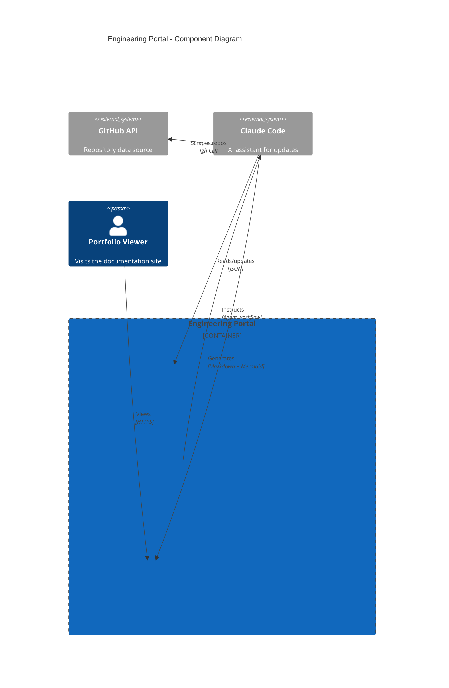

# Engineering Portal

Auto-updating portfolio site with GitHub discovery and architectural documentation.

## Overview

This repository contains the source for Keith Calvelli's engineering portfolio - a static documentation site built with MkDocs Material that showcases public GitHub projects with architectural diagrams, onboarding guides, and release information.

**Repository:** [kcalvelli/kcalvelli-portal](https://github.com/kcalvelli/kcalvelli-portal)

## Architecture



**Key Components:**
- **projects.json** - Master registry of all documented projects with display names, descriptions, tags, and diagram types
- **OPS_MANUAL.md** - Detailed instructions for the documentation generation workflow
- **OpenSpec** - Spec-driven development framework for managing changes

## Onboarding

### Prerequisites
- Nix with flakes enabled
- GitHub CLI (`gh`) authenticated

### Build the Site

```bash
# Enter development environment
nix develop

# Serve locally
mkdocs serve

# Build static site
mkdocs build
```

### Update the Portal

When in Claude Code, simply say "update" to:
1. Discover new public repositories from GitHub
2. Auto-classify with tag suggestions
3. Regenerate all documentation pages
4. Update navigation

## Release History

No releases yet.
