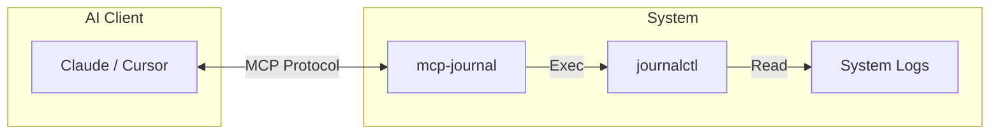

# MCP Journal

**Repo:** [kcalvelli/mcp-journal](https://github.com/kcalvelli/mcp-journal)

An MCP server that provides read-only access to `journalctl`. This enables AI agents to debug system issues by reading system logs safely.

## Architecture



## Onboarding

Run the server:

```bash
nix run github:kcalvelli/mcp-journal
```

**Security Note:** The server needs permission to read logs (usually requires user to be in `systemd-journal` group).

## Latest Status

**Release:** *Rolling*
