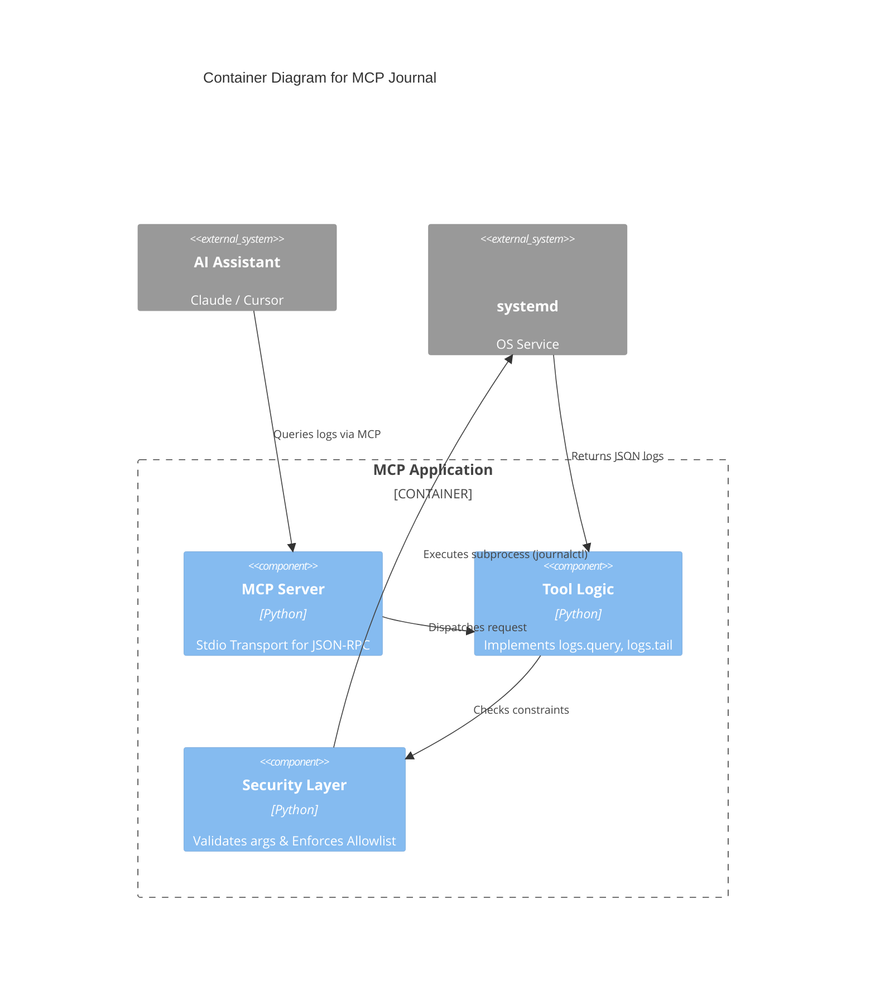

# MCP Journal

**MCP server providing read-only access to systemd journalctl.**

[View on GitHub](https://github.com/kcalvelli/mcp-journal)

## Overview

A Model Context Protocol (MCP) server that allows AI assistants to query system logs via `journalctl` and check unit status on Linux systems. It is read-only and designed for debugging and monitoring.

## Architecture

The server securely wraps the `journalctl` command-line tool, exposing a structured query interface to the MCP client.



## Onboarding

To run the server:

```bash
python3 src/mcp_journal.py
```

Or using Nix:

```bash
nix run github:kcalvelli/mcp-journal
```

## Release History

| Version | Date | Status |
| :--- | :--- | :--- |
| - | - | No releases found |