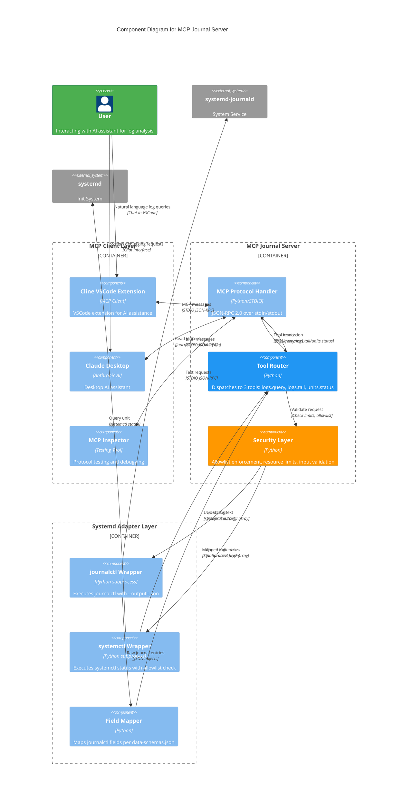

# MCP Journal

**Journal management via Model Context Protocol**

[View on GitHub](https://github.com/kcalvelli/mcp-journal)

## Overview

A Model Context Protocol (MCP) server providing read-only access to systemd journalctl. This server enables AI assistants to help debug system issues, analyze logs, and monitor services on Linux systems through natural language queries.

**Platform:** Linux-only (requires systemd and journalctl)

**Key Features:**

* **Three Core Tools:** logs.query (flexible filtering), logs.tail (recent logs), units.status (systemd unit status)
* **Read-only Security:** No system modifications, runs as invoking user, no privilege escalation
* **Allowlist Protection:** units.status restricted to approved units, prevents enumeration
* **Resource Limits:** Max 2000 entries, 30s timeout per query
* **Shell-injection Safe:** Uses subprocess argv arrays, no shell execution
* **Comprehensive Testing:** 9 acceptance tests passing, smoke test suite included

**Status:** Working MVP with complete specifications

## Architecture

The server implements a bridge/adapter pattern between MCP clients and systemd's journalctl/systemctl commands. It operates as a STDIO-based MCP server that translates tool calls into safe subprocess invocations, parses structured output, and enforces security policies. The architecture emphasizes read-only access with allowlist-based authorization.



**Architectural Assumptions:**

* **Three-layer Bridge Pattern:** MCP clients → Adapter Server → systemd commands, with clear separation between protocol handling, business logic, and system integration
* **STDIO-only Transport:** Uses stdin/stdout for MCP communication (no SSE/HTTP), designed for local invocation by MCP clients like Claude Desktop or Cline
* **Subprocess-based Integration:** All systemd interaction happens through subprocess.run() with argv arrays (never shell=True), preventing shell injection
* **JSON Output Parsing:** Exclusively uses `journalctl --output=json` for machine-readable output, parses one JSON object per line
* **Allowlist Security Model:** units.status enforces a hardcoded allowlist of approved systemd units, prevents arbitrary unit enumeration
* **Read-only by Design:** No write operations, no privilege escalation, runs with permissions of invoking user (requires user in systemd-journal group)
* **Resource Protection:** Enforces max 2000 entries per query, 30s subprocess timeout, prevents resource exhaustion attacks
* **Field Mapping:** Translates journalctl's internal fields (MESSAGE, SYSLOG_IDENTIFIER, etc.) to user-friendly names per data-schemas.json specification

## Onboarding

### Prerequisites

* **Linux system with systemd** (Ubuntu, Fedora, Arch, NixOS, etc.)
* Python 3.8+
* User must be in `systemd-journal` group for full journal access

### Quick Start

**Direct Python Execution:**

```bash
# Clone the repository
git clone https://github.com/kcalvelli/mcp-journal.git
cd mcp-journal

# Run the server (STDIO mode)
python3 src/mcp_journal.py
```

**Using Nix:**

```bash
# Run directly
nix run github:kcalvelli/mcp-journal

# Or enter development shell
nix develop github:kcalvelli/mcp-journal
```

### MCP Client Configuration

**Cline (VSCode Extension) - Recommended:**

Install [Cline extension](https://marketplace.visualstudio.com/items?itemName=saoudrizwan.claude-dev) and add to settings:

```json
{
  "mcpServers": {
    "journal": {
      "command": "python3",
      "args": ["/absolute/path/to/mcp-journal/src/mcp_journal.py"]
    }
  }
}
```

**For NixOS users:**

```json
{
  "mcpServers": {
    "journal": {
      "command": "nix",
      "args": ["run", "github:kcalvelli/mcp-journal"]
    }
  }
}
```

**Claude Desktop:**

Add to Claude Desktop configuration:

```json
{
  "mcpServers": {
    "journal": {
      "command": "python3",
      "args": ["/absolute/path/to/mcp-journal/src/mcp_journal.py"]
    }
  }
}
```

### Using the Server

Once configured, you can ask your AI assistant:

* "Show me the last 20 nginx error logs"
* "What's the status of my SSH service?"
* "Find all logs from the last hour matching 'timeout'"
* "Show me kernel messages with priority error or higher"

### Available Tools

**1. logs.query** - Flexible journal queries

```json
{
  "name": "logs.query",
  "arguments": {
    "limit": 20,
    "priority": "err",
    "unit": "nginx.service",
    "since": "2 hours ago"
  }
}
```

**2. logs.tail** - Recent logs (last 1 minute)

```json
{
  "name": "logs.tail",
  "arguments": {
    "unit": "sshd.service"
  }
}
```

**3. units.status** - Systemd unit status (allowlist-protected)

```json
{
  "name": "units.status",
  "arguments": {
    "unit": "systemd-journald.service"
  }
}
```

### Testing

**Run acceptance tests:**

```bash
python3 TESTS/acceptance_harness.py
```

**Run smoke tests:**

```bash
bash TESTS/smoke-test.sh
```

All tests passing: 9/9 acceptance tests

### Security Considerations

* Read-only: No system modifications possible
* Runs as invoking user: No privilege escalation
* Allowlist enforcement: units.status restricted to approved units
* Resource limits: Max 2000 entries, 30s timeout
* No shell injection: Uses subprocess argv arrays
* User must be in `systemd-journal` group for full access

See `SPECS/08-security.md` in the repository for complete threat model.

### Project Status

**Completed (MVP):**

* Python MCP server implementation (543 lines)
* All 3 tools: logs.query, logs.tail, units.status
* Field mapping per specification
* Allowlist enforcement
* Acceptance test harness (9 tests)
* Smoke tests
* Complete specifications (9 docs)

**In Progress:**

* `--allow-units` CLI flag
* Nix packaging improvements
* Unit tests with mocks

**Planned (v1.1):**

* Rate limiting
* Field-level redaction
* CI/CD workflows

## Release History

| Version | Date | Status |
| :--- | :--- | :--- |
| - | - | No releases found |
