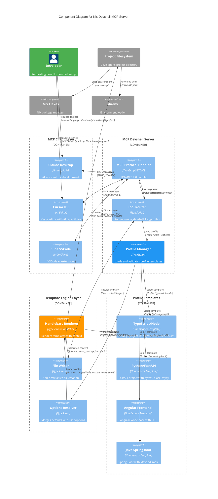

# Nix Devshell MCP

**Creation of Nix devshells via Model Context Protocol**

[View on GitHub](https://github.com/kcalvelli/nix-devshell-mcp)

## Overview

A Model Context Protocol (MCP) server that enables AI assistants to generate and scaffold Nix flake development environments from template profiles. This server bridges the gap between natural language requests and complete Nix devshell setups, providing instant project scaffolding for common development stacks.

**Key Features:**

* **4 Profile Templates:** TypeScript/Node.js, Python/FastAPI, Angular Frontend, Java Spring Boot
* **Complete Scaffolding:** Generates flake.nix, direnv configuration, and language-specific project files
* **Non-destructive:** Prevents overwriting existing files, safe to run in existing projects
* **Customizable Options:** Configure project name, versions, git initialization, and developer info
* **Direnv Integration:** Automatic .envrc generation for seamless shell activation
* **Template Engine:** Uses Handlebars for flexible profile templates

## Architecture

The server implements a template-based code generation system that translates profile selections and configuration options into complete Nix flake environments. It operates as an MCP server that receives tool calls from AI clients, applies Handlebars templates, and writes scaffolding files to the filesystem while preventing destructive overwrites.



**Architectural Assumptions:**

* **Template-based Generation:** All profiles are Handlebars templates stored in `templates/` directory, allowing easy addition of new language/framework profiles
* **Two-tool API:** Provides `list_profiles` (discovery) and `create_devshell` (generation), following MCP best practices for tool design
* **Non-destructive Writes:** File writer checks for existing files before writing, preventing accidental overwrites of user code
* **Profile Metadata:** Each profile includes metadata (description, defaultOptions, files array), stored alongside templates for consistency
* **Option Merging:** User options override profile defaults, which override global defaults (name, email, projectName)
* **Direnv-first Workflow:** Always generates .envrc for automatic shell activation, assuming direnv is the primary interaction method
* **Flake-centric Design:** All profiles generate flake.nix as the source of truth, other config files (package.json, pyproject.toml) are minimal wrappers
* **Git Integration:** Optional `gitAutoInit` flag runs `git init` and creates .gitignore, but never auto-commits

## Onboarding

### Prerequisites

* **Nix with flakes enabled**
* **direnv** (recommended for automatic shell activation)
* **Node.js/npm** (for development only, not required for usage)

### Quick Start - Run Without Installation

Try the server directly without installing:

```bash
# Install in Claude Desktop (automatic server start)
npx @kcalvelli/nix-devshell-mcp install

# Or run manually
npx @kcalvelli/nix-devshell-mcp
```

### MCP Client Configuration

**Claude Desktop:**

Add to Claude Desktop configuration (`~/Library/Application Support/Claude/claude_desktop_config.json` on macOS):

```json
{
  "mcpServers": {
    "nix-devshell-mcp": {
      "command": "npx",
      "args": ["-y", "@kcalvelli/nix-devshell-mcp"]
    }
  }
}
```

**Cursor IDE:**

Add to `.cursor/mcp.json`:

```json
{
  "mcpServers": {
    "nix-devshell-mcp": {
      "command": "npx",
      "args": ["-y", "@kcalvelli/nix-devshell-mcp"]
    }
  }
}
```

**Cline (VSCode Extension):**

Add to Cline MCP settings:

```json
{
  "mcpServers": {
    "nix-devshell-mcp": {
      "command": "npx",
      "args": ["-y", "@kcalvelli/nix-devshell-mcp"]
    }
  }
}
```

### Using the Server

Once configured, you can ask your AI assistant:

* "Create a TypeScript Node.js project with Nix"
* "Set up a Python FastAPI development environment"
* "Scaffold an Angular frontend project with Nix flakes"
* "What Nix devshell profiles are available?"

### Available Tools

**1. list_profiles** - Discover available templates

Returns all available profile templates with descriptions:

```json
{
  "name": "list_profiles"
}
```

**2. create_devshell** - Generate Nix devshell

```json
{
  "name": "create_devshell",
  "arguments": {
    "projectPath": "/home/user/my-project",
    "profile": "typescript-node",
    "options": {
      "projectName": "my-app",
      "nodeVersion": "20",
      "name": "Your Name",
      "email": "your@email.com",
      "gitAutoInit": true
    }
  }
}
```

### Available Profiles

**1. typescript-node**

Full-stack TypeScript project with:

* Node.js (configurable version)
* TypeScript with strict config
* ESLint + Prettier
* Jest for testing
* ESM module system
* package.json scaffold

**2. python-fastapi**

Python FastAPI backend with:

* Python (configurable version)
* FastAPI + Uvicorn
* pytest for testing
* black + mypy + ruff
* pyproject.toml scaffold
* Virtual environment setup

**3. angular-frontend**

Angular frontend project with:

* Node.js + Angular CLI
* TypeScript strict mode
* Angular workspace config
* Development server setup
* package.json with Angular scripts

**4. java-spring-boot**

Java Spring Boot application with:

* JDK (configurable version)
* Spring Boot dependencies
* Maven or Gradle
* Project structure scaffold
* pom.xml or build.gradle

### Development

**Clone and build:**

```bash
git clone https://github.com/kcalvelli/nix-devshell-mcp
cd nix-devshell-mcp

# Build the project
nix build

# Or use npm
npm install
npm run build
```

**Run in development mode:**

```bash
npm run dev
```

**Add a new profile:**

1. Create template in `templates/<profile-name>/`
2. Add `profile.json` with metadata
3. Create Handlebars templates for each file
4. Update profile manager to register new profile

### Nix Flake Usage

Add as a flake input:

```nix
{
  inputs = {
    nix-devshell-mcp.url = "github:kcalvelli/nix-devshell-mcp";
  };

  outputs = { self, nixpkgs, nix-devshell-mcp }: {
    # Use in your configuration
  };
}
```

Run the server:

```bash
nix run github:kcalvelli/nix-devshell-mcp
```

## Release History

| Version | Date | Status |
| :--- | :--- | :--- |
| - | - | No releases found |
