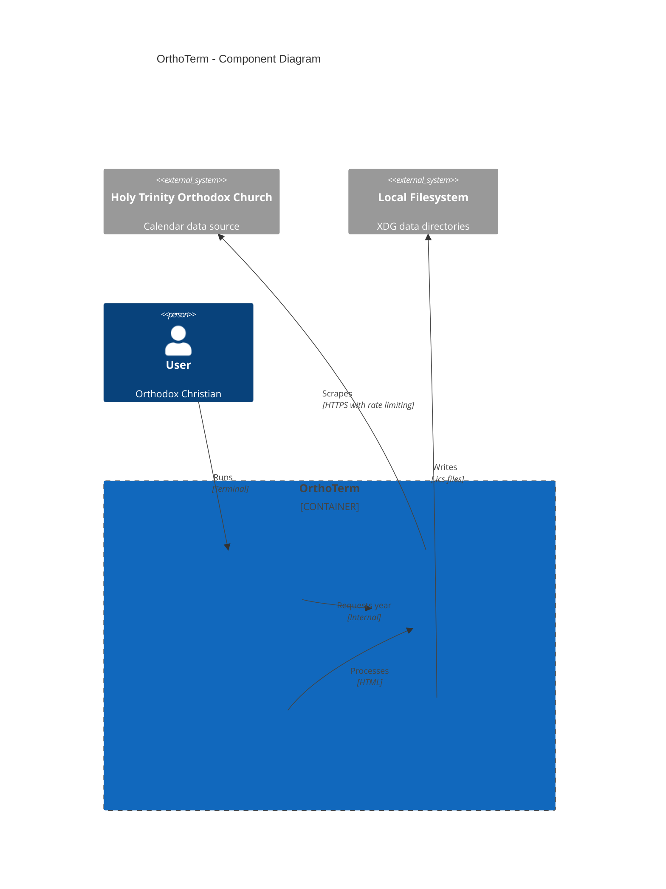

# Orthoterm

Orthodox calendar terminal application.

## Overview

OrthoTerm is a command-line tool for fetching Orthodox Christian calendar data and generating iCal files. It provides easy access to daily saints, readings, and liturgical notes from the Orthodox calendar, with support for both Gregorian and Julian dates.

**Repository:** [kcalvelli/orthoterm](https://github.com/kcalvelli/orthoterm)

## Architecture



**Key Features:**
- Fetch Orthodox calendar data for any year
- Generate iCal files for calendar integration
- Support for both Gregorian and Julian calendar dates
- Local data storage using XDG base directories
- Automatic caching of calendar data
- Respectful scraping with rate limiting and exponential backoff

**Calendar Data Includes:**
- Daily saints and commemorations
- Scripture readings from the Orthodox lectionary
- Troparia and kontakia
- Fasting guidelines
- Major feast days

## Onboarding

### Installation

#### Using Nix

```bash
nix develop  # Enter development shell
cargo build
```

#### From Source

```bash
git clone https://github.com/kcalvelli/orthoterm.git
cd orthoterm
cargo install --path .
```

### Usage

```bash
# Fetch current year's calendar data
orthoterm

# Fetch specific year's data
orthoterm 2025

# Generate iCal file for a year
orthoterm -i 2025
```

### Output Files

OrthoTerm stores data in XDG directories:
- Calendar data: `~/.local/share/orthoterm/data/calendar_YEAR.json`
- iCal files: `~/.local/share/orthoterm/ical/calendar_YEAR.ics`

## Release History

No releases yet.
