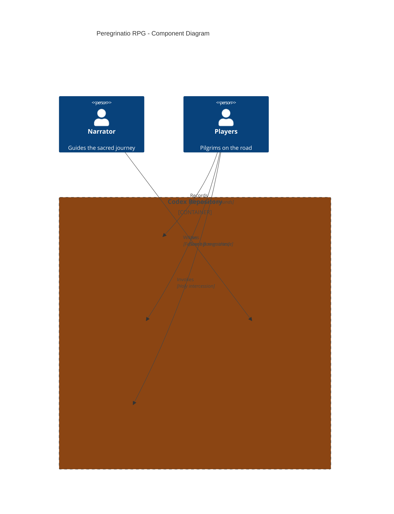

# Peregrinatio RPG

A Roleplaying Game of Exile and Pilgrimage, AD 870.

## Overview

Peregrinatio is a tabletop roleplaying game set in 9th-century Europe, where players take on the roles of exiled pilgrims traveling through a world of faith, danger, and miraculous encounters. This repository contains the handouts, character sheets, and quick references styled in the manner of a medieval codex.

**Repository:** [kcalvelli/peregrinatio-rpg](https://github.com/kcalvelli/peregrinatio-rpg)

## Architecture

**Game Materials:**
- **Character Sheets** - Four archetypes: Knight, Navigator, Monastic, Illuminator
- **Campaign Chronicle** - Record missions, relics, scars, and blessings
- **Mission Materials** - Player log and narrator tracker
- **Saints Reference** - d20 Intercession table with prayers

## Onboarding

### How to Play

1. **Begin with Character Sheets** - Each player chooses Knight, Navigator, Monastic, or Illuminator. Record starting Virtues and Wounds.
2. **Keep the Mission Log** - After each mission, players record what happened, what was learned, and any Virtue shifts.
3. **Narrator Guides with Tracker** - Use `mission-tracker.md` to frame each mission's flow: Aftermath, Tasks, Challenge, Climax, Resolution.
4. **Record the Chronicle** - Over time, fill `campaign-chronicle.md` with relics, scars, blessings, and memories.
5. **Call on the Saints** - Use `saints-quick-roll.md` when the fellowship invokes holy aid.

### Repository Contents

| File | Purpose |
|------|---------|
| `character-sheet-*.md` | Player character sheets by archetype |
| `campaign-chronicle.md` | Living hagiography of the pilgrimage |
| `mission-log.md` | Player-facing mission record |
| `mission-tracker.md` | Narrator-facing guide |
| `narrator-quick-reference.md` | Quick rules reference |
| `saints-quick-roll.md` | d20 Intercession table |

## Release History

No releases yet.
